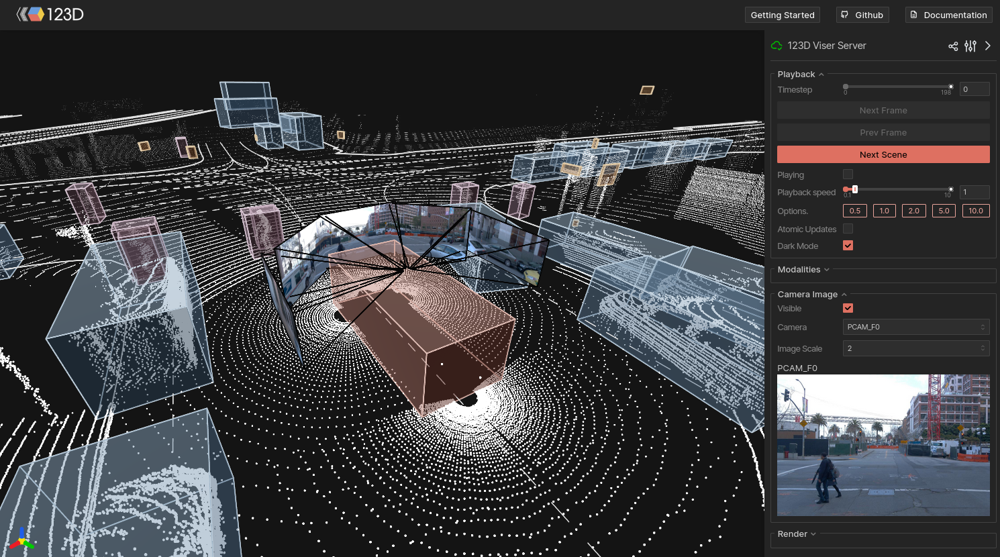

<h1 align="center">
  <picture>
    <source media="(prefers-color-scheme: dark)" srcset="https://autonomousvision.github.io/py123d/_static/123D_logo_transparent_white.svg" width="500">
    <source media="(prefers-color-scheme: light)" srcset="https://autonomousvision.github.io/py123d/_static/123D_logo_transparent_black.svg" width="500">
    
  </picture>
  <h2 align="center">123D: A Unified Library for Multi-Modal Autonomous Driving Data</h2>
  <h3 align="center"><a href="https://youtu.be/Q4q29fpXnx8">Video</a> | <a href="https://autonomousvision.github.io/py123d/">Documentation</a></h3>
</h1>

<p align="center">
  <a href="https://pypi.org/project/py123d/"></a>
  <a href="https://pypi.org/project/py123d/"></a>
  <a href="https://github.com/autonomousvision/py123d/blob/main/LICENSE"></a>
</p>

**One library for autonomous driving datasets.** 123D converts raw data from Argoverse 2, nuScenes, nuPlan, KITTI-360, PandaSet, and Waymo into a fast, unified [Apache Arrow](https://arrow.apache.org/) format, and then gives you a single API to read cameras, lidar, HD maps, and labels across all of them.

## Features

- **Unified API**: Read cameras, lidar, maps, and labels through a single interface, regardless of the source dataset.
- **Apache Arrow storage**: columnar, memory-mapped, zero-copy reads. Fast and memory efficient.
- **Multiple sensor codecs**: MP4/JPEG/PNG for cameras; LAZ/Draco/Arrow IPC for lidar.
- **Built-in visualization**: interactive 3D viewer ([Viser](https://viser.studio/main/)), and [matplotlib](https://matplotlib.org/) plotting.
- **No sensor data duplication**: By default, converted logs reference original camera and lidar files via relative paths. No need to store sensor data twice.
- **Hydra-based conversion CLI**: YAML configs to manage your data pipelines.

## Viewer

<p align="center">
  
</p>

## Supported Datasets

| Dataset | Cameras | LiDARs | Map | 3D Boxes | Traffic Lights |
|:--------|:-------:|:------:|:---:|:--------:|:--------------:|
| [Argoverse 2 - Sensor](https://www.argoverse.org/) | 9 | 2 | ✓ | ✓ | ✗ |
| [nuScenes](https://www.nuscenes.org/) | 6 | 1 | ✓ | ✓ | ✗ |
| [nuPlan](https://www.nuscenes.org/nuplan) | 8 | 5 | ✓ | ✓ | ✓ |
| [KITTI-360](https://www.cvlibs.net/datasets/kitti-360/) | 4 | 1 | ✓ | ✓ | ✗ |
| [PandaSet](https://pandaset.org/) | 6 | 2 | ✗ | ✓ | ✗ |
| [Waymo Open - Perception](https://waymo.com/open/) | 5 | 5 | ✓ | ✓ | ✗ |
| [Waymo Open - Motion](https://waymo.com/open/) | ✗ | ✗ | ✓ | ✓ | ✓ |
| [CARLA / LEAD](https://github.com/autonomousvision/lead) | config. | config. | ✓ | ✓ | ✓ |
| [NVIDIA Physical AI AV](https://huggingface.co/datasets/nvidia/PhysicalAI-Autonomous-Vehicles) *(experimental)* | 7 | 1 | ✗ | ✓ | ✗ |


## Changelog

<details open>
<summary><b>v0.1.0</b> (2026-03-22)</summary>

- Asynchronous (native-rate) data storage: modalities are now written at their original capture rate, not just at the a frame-wise rate.
- New parser architecture with `BaseLogParser.iter_modalities_async` for native-rate iteration alongside the existing synchronized path.
- Added NVIDIA Physical AI AV dataset support (experimental).
- Added standalone OpenDRIVE / CARLA map parser.
- Refactored `conversion/` module into `parser/` with consistent naming across all dataset parsers.
- Refactored Viser 3D viewer. Adds more control and dark mode.
- Added `LaneType`, `IntersectionType`, `StopZoneType` to map data structure.
- Replaced Waymo heavy dependencies with lightweight protobufs.
- Various fixes to camera-to-global transforms across all datasets.

</details>

<details>
<summary><b>v0.0.9</b> (2026-02-09)</summary>

- Added Waymo Open Motion Dataset support.
- Replaced gpkg map implementation with Arrow-based format for improved performance.
- Added sensor names and timestamps to camera and Lidar data across all datasets.
- Added ego-to-camera transforms in static metadata.
- Implemented geometry builders for PoseSE2/PoseSE3 from arbitrary rotation/translation representations.
- Added support for loading merged point clouds in API.
- Improved map querying speed and OpenDrive lane connectivity handling.
- Added recommended conversion options to dataset YAML configuration files.
- Fixed PandaSet static extrinsics and KITTI-360 timestamp handling.
- Fixed memory issues when converting large datasets (e.g., nuPlan).

</details>

<details>
<summary><b>v0.0.8</b> (2025-11-21)</summary>

- Release of package and documentation.
- Demo data for tutorials.

</details>

## Citation

```bibtex
@software{Contributors123D,
  title   = {123D: A Unified Library for Multi-Modal Autonomous Driving Data},
  author  = {123D Contributors},
  year    = {2026},
  url     = {https://github.com/autonomousvision/py123d},
  license = {Apache-2.0}
}
```


## License

123D is released under the [Apache License 2.0](LICENSE).
